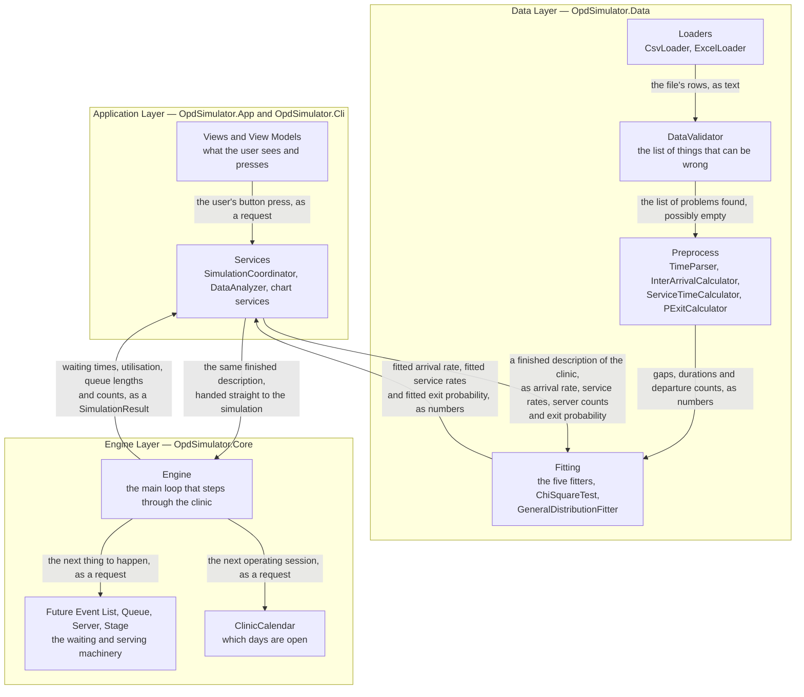
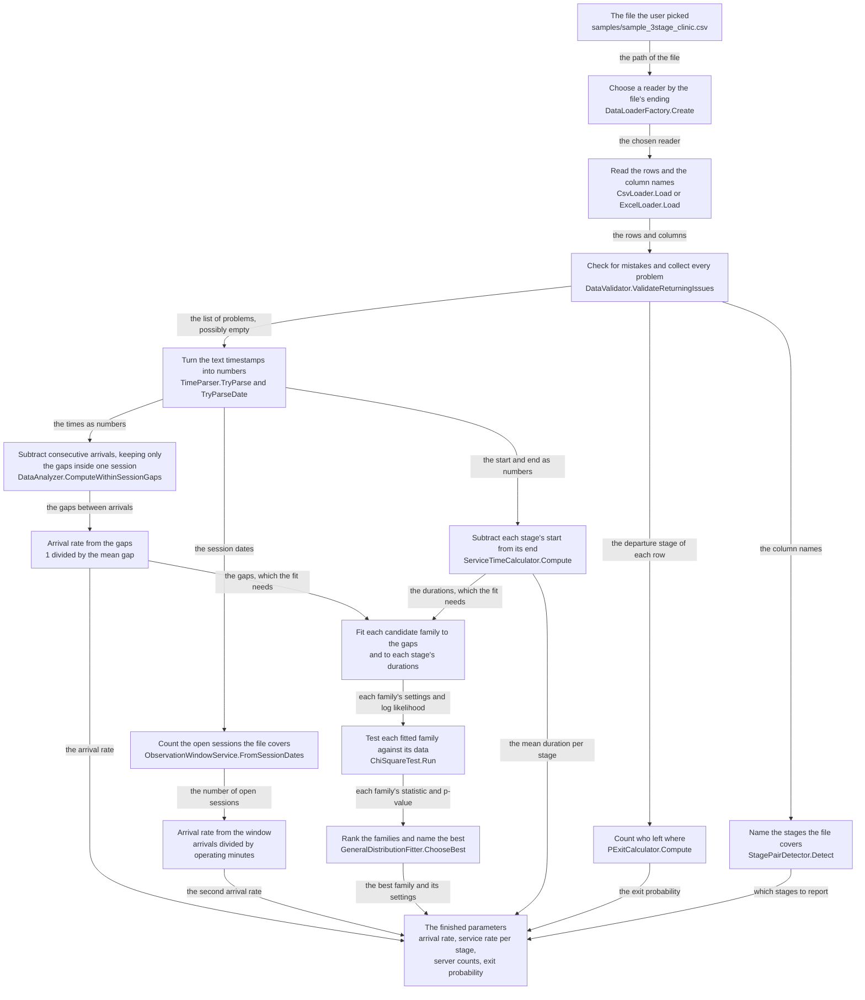

# Calculations and Flow Reference — OPD Clinic Queue Simulator

- **Project:** OPD Clinic Queue Simulator
- **Commit:** `fadea0879f51e8085101b858d174287969a2b01a`
- **Generated:** 2026-09-30
- **Revision:** The Glossary and Sections 0 to 2 are complete in this revision.
  The remaining sections are still to be written; their titles are not listed
  below, because a table of contents entry for a section that does not exist yet
  would be a guess. This document will grow to twelve sections in all.
- **Reading guide:** This document assumes no prior knowledge of queueing theory,
  simulation, or statistics. Every term is defined before it is used. Read the
  Glossary first if you want a preview; otherwise the terms will be introduced as
  they appear.

**Where the numbers in this document come from.** Every figure that describes a
real run, a real fit, or a real check comes from one committed file:
`docs/sample_run_reference.txt`. That file is the unmodified standard output of
commands run against the sample data files in `samples/`, and each block names the
exact command that produced it. You can reproduce every worked example in this
document by re-running the commands printed above it. Nothing in this document is
an estimate, a rounding of an estimate, or a plausible-looking invention.

**A note on the two kinds of file in this project.** The simulator's own
programming is written in a language called C#. File names ending in `.cs` are
C# source files. Throughout this document, a name in that style — `CsvLoader`,
`ChiSquareTest`, `Engine` — is the exact name of a piece of code, and it is
always given in full and spelled exactly as the code spells it. Those names are
not abbreviations; they are references.

---

## Table of contents

- [Glossary](#glossary)
- [Section 0 — What this simulator does](#section-0--what-this-simulator-does)
  - [0.1 The clinic](#01-the-clinic)
  - [0.2 Queues and servers](#02-queues-and-servers)
  - [0.3 Why simulate instead of measure?](#03-why-simulate-instead-of-measure)
  - [0.4 The three stages](#04-the-three-stages)
  - [0.5 What the simulator produces](#05-what-the-simulator-produces)
  - [0.6 Code reference](#06-code-reference)
- [Section 1 — The big picture: three layers](#section-1--the-big-picture-three-layers)
  - [1.1 The Engine Layer](#11-the-engine-layer)
  - [1.2 The Data Layer](#12-the-data-layer)
  - [1.3 The Application Layer](#13-the-application-layer)
  - [1.4 The boundaries, and why they exist](#14-the-boundaries-and-why-they-exist)
  - [1.5 Diagram: the three layers and what flows between them](#15-diagram-the-three-layers-and-what-flows-between-them)
  - [1.6 Code reference](#16-code-reference)
- [Section 2 — From a spreadsheet to fitted parameters](#section-2--from-a-spreadsheet-to-fitted-parameters)
  - [2.1 Reading the file](#21-reading-the-file)
  - [2.2 Checking the file for mistakes](#22-checking-the-file-for-mistakes)
  - [2.3 Understanding timestamps](#23-understanding-timestamps)
  - [2.4 Computing derived quantities](#24-computing-derived-quantities)
  - [2.5 Fitting a probability distribution](#25-fitting-a-probability-distribution)
  - [2.6 Testing whether the fit is good](#26-testing-whether-the-fit-is-good)
  - [2.7 Comparing candidate distributions](#27-comparing-candidate-distributions)
  - [2.8 The observation window and two arrival rates](#28-the-observation-window-and-two-arrival-rates)
  - [2.9 Diagram: the data pipeline](#29-diagram-the-data-pipeline)
  - [2.10 Code reference](#210-code-reference)

---

# Glossary

Terms are listed alphabetically. Each entry gives the term, a plain-language
definition, and the section where it is used. If you meet a term in the body of
the document before you look it up here, it will be explained again at that point.

**Akaike Information Criterion** — A single number that scores how well a
statistical model explains a set of measurements, after subtracting a penalty for
how many adjustable settings the model needed. Lower is better. Section 2.7.

**Alpha (α)** — The Greek letter alpha, read aloud "AL-fuh", used for the
significance level: the threshold a p-value is compared against. The program uses
0.05. Section 2.6.

**Analytical validation** — Checking a computer simulation against a formula
written out on paper, to prove the simulation is right. Section 5.

**Arrival rate (lambda)** — How many patients arrive per minute on average. Written
with the Greek letter lambda (λ). Section 2.4.

**Auto-fit** — Letting the program choose which distribution shape matches the
data, instead of the user naming one. Section 6.

**Bayesian Information Criterion** — A score like the Akaike Information
Criterion, but with a harsher penalty for extra adjustable settings. Lower is
better. Section 2.7.

**Bin** — One of several labelled buckets that a set of measurements is sorted
into, so the program can count how many landed in each. Section 2.6.

**Chi (χ)** — The Greek letter chi, read aloud "KY". Squared, as χ², it is the
symbol for the chi-square statistic. Section 2.6.

**Chi-square test** — A calculation that asks whether the pattern of counts in
those buckets is close enough to what the fitted model predicted to be plausible.
Section 2.6.

**Clinic** — An outpatient department: the part of a hospital where people come
in during the day for an appointment rather than staying overnight. Section 0.

**Confidence** — How sure we are. A 95 percent confidence statement means: if
this whole measurement procedure were repeated many times, about 95 percent of the
results would land inside the stated range. Section 2.6.

**Cumulative Distribution Function** — For any value, the fraction of the
distribution that falls at or below it. As a fraction of a whole, it is written
"100 percent" when the whole is included. Section 2.5.

**Degrees of freedom** — The number of independent pieces of information left
over after the buckets and the fitted settings have been accounted for. It sets how
many degrees of surprise the test allows. Section 2.6.

**Deterministic** — Having no randomness at all: the same input always gives the
same output, and every patient at a stage takes exactly the same length of time.
Section 2.5.

**Discrete-Event Simulation** — A way of modelling a process by jumping from one
moment that matters to the next, instead of advancing a clock in small steps.
Section 3.

**Distribution** — A description of how likely each possible value is. Section 2.5.

**Erlang-C formula** — A long, closed-form piece of algebra from queueing theory
that predicts the average waiting time for a queue with several servers when
arrivals and service times both follow the exponential shape. Section 5.2.

**Estimator** — The rule that turns a set of measurements into a single number.
Here the estimator for the arrival rate is "divide 1 by the mean of the gaps".
Section 2.4.1.

**Event** — Something that happens at one exact moment and changes the state of
the model. Section 3.

**Event trace** — A written record, one line per event, of everything the
simulation did and in what order. Section 3.

**Exit probability** — The chance that a patient finishes at screening and leaves
the clinic instead of going on to see a doctor. Section 2.4.

**Exponential distribution** — A distribution in which short waits are common and
long waits are rare, with the shape of a decaying curve. Section 2.5.

**Future Event List** — The ordered list of everything that is scheduled to happen
but has not happened yet, kept sorted so the next thing is always at the front.
Section 3.

**Gamma distribution** — A family of right-skewed shapes with one adjustable
setting for how spread out the values are. It reduces to the exponential
distribution at one particular setting. Section 2.5.

**Goodness of fit** — How closely a fitted distribution actually describes the
measurements it was fitted to. Section 2.6.

**Headless command-line program** — A companion program that does the same work as
the graphical application but is run by typing instructions into a terminal rather
than by clicking. It prints plain text and no pictures. Sections 2.1, 11.

**Inter-arrival time** — The gap between one patient walking in and the next
patient walking in. Section 2.4.

**Kappa (κ)** — The Greek letter kappa, read aloud "KAP-uh", used in
mathematical writing for the shape setting of the Gamma distribution. The program
prints the word "shape" instead. Section 2.5.4.

**Lambda (λ)** — The Greek letter lambda, used for the arrival rate. Read aloud as
"LAM-uh". Section 2.4.

**Likelihood** — How probable the measurements you actually observed would be, if
a particular distribution were the truth. Higher is more probable. Section 2.5.

**Logarithm** — The number of times you must raise a fixed base to reach a given
value. The base is 10 unless the text says "natural logarithm", in which case it
is the number e, roughly 2.71828. Section 2.5.3.

**Log-likelihood** — The natural logarithm of the likelihood. A manageable
negative number, where the likelihood itself is often a vanishingly small
positive one. Section 2.5.

**Lognormal distribution** — A distribution built by taking the logarithm of every
value first. If those logarithms form a bell, the original values form this
distribution. Because a logarithm is never negative for a positive value, the
original values can never be negative either. Section 2.5.3.

**Maximum Likelihood Estimation** — The method of choosing a distribution's
adjustable settings so that the observed measurements are as probable as possible
under it. Section 2.5.

**Mean** — The ordinary average: add all the values and divide by how many there
are. Section 2.4.

**Moment** — A summary of the shape of a set of numbers. The average is the first
moment; the variance is the second. Section 2.5.4.

**Moment matching** — Choosing a distribution's settings so that the
distribution's own average and variance equal the average and variance of the
measurements. Section 2.5.4.

**Mu (μ)** — The Greek letter mu, used for the service rate. Read aloud as
"MYOO". Section 2.4.

**Natural logarithm** — A logarithm to base e, where e is roughly 2.71828. It is
the logarithm the fitters use because a logarithm turns a product into a sum: the
probability of a whole set of measurements is the product of their individual
probabilities, and taking the natural logarithm turns that product into a sum the
program can add up one measurement at a time. Section 2.5.

**Normal distribution** — The bell-shaped distribution, symmetrical about its
average. Section 2.5.

**Null hypothesis** — The statement being tested, phrased as the position of
"nothing unusual is going on". In a goodness-of-fit test it is "the measurements
really do follow the distribution I fitted". Section 2.6.

**Observation window** — How much operating time the loaded data actually covers,
counted in clinic sessions rather than in calendar days. Section 2.8.

**Operating time** — Time during which the clinic was open and patients could
actually be arriving or being served. It is not the same as calendar time. Section
4.12.

**Poisson process** — Arrivals that come in independently of the past, at a
constant average rate, one at a time. Section 2.8.

**Probability density function** — For a continuous quantity, the height of the
curve at each value, where the total area under the curve is the whole
probability, one hundred percent. Section 2.5.

**p-value** — The answer to the question "if my model were true, how surprising
would the data I actually collected be?" A small number means very surprising.
Section 2.6.

**Quantile** — The value below which a stated fraction of a distribution falls. The
"80th percentile" is the value with 80 percent of the distribution below it.
Section 2.5.

**Queue** — The line of people waiting. Section 0.

**Queueing theory** — The branch of mathematics that studies lines and the people
or machines serving them. Section 0.

**Random number generator** — The piece of computer code that produces the
sequence of "random" numbers the simulation draws on. Section 3.

**Rho (ρ)** — The Greek letter rho, used for traffic intensity: how busy a stage
is relative to what it could handle if it were never idle. Read aloud as "ROW".
Section 4.11.

**Seed** — The starting number handed to the random number generator. Changing it
changes the whole random sequence; keeping it the same repeats the same run.
Section 3.

**Server** — Anything that provides service to one person at a time. Here that is
a receptionist, a screening nurse, or a doctor. Section 0.

**Service rate (mu)** — How many patients one server can finish per minute on
average. Written with the Greek letter mu (μ). Section 2.4.

**Service time** — How long one server takes with one patient. Section 2.4.

**Session** — One day the clinic was open. The clinic opens on Monday, Tuesday,
Wednesday, Thursday and Saturday, and is shut on Friday and Sunday. Section 2.8.

**Significance level** — The threshold the test compares the p-value against. The
program uses 0.05, which means five percent. Section 2.6.

**Simulation** — A program that imitates a process by generating numbers from
rules and stepping through the consequences, rather than solving equations for
the whole process at once. Section 0.

**Stability** — The condition under which a queue settles down instead of growing
forever. Section 4.11.

**Stage** — One step in the patient's journey through the clinic. Section 0.

**Standard Deviation** — The typical distance of a measurement from the average,
in either direction. A large value means the measurements are spread out; a small
value means they cluster. Section 2.5.

**Throughput** — How many patients per minute finish being served. Section 4.7.

**Traffic intensity** — How much work arrives compared to how much the stage could
handle if it were always busy. Written with the Greek letter rho (ρ). Section 4.11.

**Uniform distribution** — A flat distribution: every value in a stated range is
equally likely. Section 2.5.

**Utilisation** — The fraction of the operating time a server spent actually
serving someone, rather than idle. Section 4.8.

**Variance** — The square of the Standard Deviation, so it is measured in squared
minutes rather than minutes. Formulas use it because it adds cleanly: when two
independent sources of variation are combined, their variances add, whereas their
Standard Deviations do not. Section 2.5.

**View Model** — The piece of code that holds what the User Interface is showing
and turns button presses into requests. Section 1.

**Waiting time** — How long a patient spends standing in a queue before a server
starts with them. Section 4.1.

---

# Section 0 — What this simulator does

## 0.1 The clinic

An **outpatient department** is the part of a hospital where people come in
during the day for an appointment and then go home, rather than staying overnight
in a bed. It is the busiest and most frustrating part of most hospitals, because
almost everybody arrives at roughly the same time — in the morning, just after the
doors open — and there are only so many staff to see them.

This project models one such department with three steps.

The clinic opens on **Monday, Tuesday, Wednesday, Thursday and Saturday**. It is
**shut on Friday and Sunday**. Each day it is open, patients arrive between
**8:15 in the morning and 11:00 in the morning**, which is 165 minutes. That 165
minutes is called an operating session.

## 0.2 Queues and servers

A **queue** is a line of people waiting. A **server** is anything that provides
service to one person at a time — here, a receptionist, a screening nurse, or a
doctor. One server can serve one patient at a time and nobody else. If three
patients are waiting and two servers are free, only two of them start
immediately and the third keeps waiting.

The branch of mathematics that studies lines and the things serving them is called
**queueing theory**. This document does not assume you know anything about it.

## 0.3 Why simulate instead of measure?

You might reasonably ask: the clinic already keeps records. Why not just read the
records?

Because records tell you what already happened. They cannot tell you what would
happen if you changed something. If the clinic hires a third screening nurse, will
the average wait actually fall? If it moves screening from two tables to four,
does the waiting room empty out or does it stay just as crowded? If the clinic
stops sending patients on to the doctor, how much does the doctor stage improve?

Answers to those questions cannot be measured, because you cannot try every
option on real patients. A **simulation** — a program that imitates the process by
generating numbers from rules and stepping through the consequences — lets you try
each option without waiting on real people. That is why this project exists.

## 0.4 The three stages

A patient does not go straight to a doctor. The journey has three steps, and the
project calls each step a **stage**:

1. **Reception.** A receptionist takes the patient's details and issues a numbered
   token. One receptionist works here.
2. **Screening.** A nurse checks the patient over. Two screening tables work here.
3. **Doctor.** A doctor consults the patient. Three doctors work here.

After screening, the patient either leaves the clinic or goes on to see a doctor.
Which one happens is not a decision the patient makes freely — it depends on what
the screening found. The project measures this as an **exit probability**: out of
every hundred patients who finish screening, roughly how many leave without seeing
a doctor.

In the sample configuration used throughout this document, 70 out of every 100
patients leave after screening and 30 go on to a doctor.

## 0.5 What the simulator produces

Running the simulation produces four kinds of answer.

**Waiting times.** How long patients wait at each stage, and how long they spend
in the clinic in total.

**Utilisation.** How much of the working time each receptionist, nurse and doctor
actually spent serving someone, as opposed to sitting idle. A stage where the
doctors are 95 percent busy is close to falling apart; a stage at 20 percent busy
is being wasted.

**Queue lengths.** How many people were waiting, and how that number changed over
the course of the run.

**A statistical check that the numbers can be trusted.** Two separate checks. The
first asks whether the assumptions the simulator started from are a reasonable
description of the real clinic's records. The second asks whether the simulator
actually produced values of the kind it was told to produce. Neither check proves
anything on its own, and this document says exactly what each one can and cannot
establish, in Sections 2.6 and 2.7.

## 0.6 Code reference

| What | Where |
|---|---|
| Which days the clinic is open, and the 8:15-to-11:00 window | `src/OpdSimulator.Core/Calendar/ClinicCalendar.cs` |
| The three stages the engine can model | `src/OpdSimulator.Core/Stages/NetworkTopology.cs` |
| The clinic's fixed stage order, and where patients may exit | `src/OpdSimulator.Data/Preprocess/ClinicStageOrder.cs` |
| Server counts and the shape of a run | `src/OpdSimulator.Core/Engine/EngineConfig.cs` |
| Every number Section 0.5 lists as an output | `src/OpdSimulator.Core/Engine/StageMetrics.cs` and `src/OpdSimulator.Core/Engine/SimulationResult.cs` |

---

# Section 1 — The big picture: three layers

The simulator's code is sorted into **three layers**. A layer is simply a group of
files with one job. Each layer is a separate project with its own name, and the
projects are listed together in `OpdSimulator.sln`, the file that tells the
development tool which projects belong to this program.

- `OpdSimulator.Core` — the **Engine Layer**
- `OpdSimulator.Data` — the **Data Layer**
- `OpdSimulator.App` — the **Application Layer**

There is a fourth project, `OpdSimulator.Cli`, the headless command-line program.
It sits alongside the Application Layer and obeys exactly the same boundary
rules.

## 1.1 The Engine Layer

**What belongs in it:** the simulation itself. The rules for what happens when a
patient arrives, the queues people wait in, the servers who serve them, the
calendar of which days the clinic is open, the samplers that produce random
numbers, and the code that measures what happened.

Its home is `src/OpdSimulator.Core/`, split into these folders:

| Folder | What lives there |
|---|---|
| `Core/Engine/` | `Engine` — the main loop; `SimulationResult` and `StageMetrics` — the numbers it produces |
| `Core/Events/` | `Event`, `EventType`, and `FEL` — the Future Event List |
| `Core/Queues/` | `Queue` — the line of waiting patients |
| `Core/Servers/` | `Server` and the two rules for choosing which server gets the next patient |
| `Core/Stages/` | `Stage`, `StageSpec`, `NetworkTopology` — the shape of the clinic |
| `Core/Patients/` | `Patient` — one person moving through the clinic |
| `Core/Distributions/` | The samplers that turn a rule into an actual random number |
| `Core/Trace/` | The event trace: the written record of the run |
| `Core/Calendar/` | `ClinicCalendar` — which days are open, and the 8:15-to-11:00 window |

**What must NOT belong in it:** anything that draws a window, opens a file, or
displays a number to a person. The Engine Layer has no screen. It has no buttons.
It has no way to read a spreadsheet.

**Proof, not promise.** `src/OpdSimulator.Core/OpdSimulator.Core.csproj` contains
no reference to any other project in the solution. It cannot call the Data Layer
even by accident, because the door is not there.

## 1.2 The Data Layer

**What belongs in it:** everything to do with turning a file into numbers. Reading
the file, checking it for mistakes, converting timestamps into numbers, computing
gaps and durations, working out where patients left, and fitting distributions to
the result.

Its home is `src/OpdSimulator.Data/`:

| Folder | What lives there |
|---|---|
| `Data/Loaders/` | `CsvLoader` and `ExcelLoader` — reading the file into memory |
| `Data/Validation/` | `DataValidator` — the list of things that can be wrong |
| `Data/Preprocess/` | `TimeParser`, `InterArrivalCalculator`, `ServiceTimeCalculator`, `PExitCalculator`, `StagePairDetector` |
| `Data/Fitting/` | The five distribution fitters, the chi-square test, `GeneralDistributionFitter` |
| `Data/Parameters/` | `ModeValidator` — checking the user's rate-or-mean choice |
| `Data/Export/` | `DataExporter` — writing a cleaned file back out |

**What must NOT belong in it:** anything that draws a window, and anything that
runs a simulation. The Data Layer never simulates. It produces numbers and stops.

**Proof.** `src/OpdSimulator.Data/OpdSimulator.Data.csproj` references exactly one
project: `OpdSimulator.Core`. It knows how the Engine Layer's vocabulary is
spelled, and nothing else.

## 1.3 The Application Layer

**What belongs in it:** the screen the person actually uses, and the code that
organises the work.

Its home is `src/OpdSimulator.App/`:

| Folder | What lives there |
|---|---|
| `App/Views/` | The layout files, written in a language called XAML, that describe where each box goes |
| `App/ViewModels/` | The **View Models** — the code that holds what is on screen and turns button presses into requests |
| `App/Controls/` | The reusable pieces of screen: dropdowns, toasts, dialogs, the data preview table |
| `App/Services/` | The pieces that coordinate: `SimulationCoordinator` runs the simulation; `DataAnalyzer` turns a file into parameters; the chart services build the pictures |
| `App/Models/` | The small records that carry settings between the screen and the engine |

The headless command-line program lives in `src/OpdSimulator.Cli/` and follows the
same rule: it references the Engine Layer and the Data Layer, and draws nothing.

**What must NOT belong in it:** simulation rules and file-format rules. When the
Application Layer runs a simulation, it hands the Engine Layer a finished
description of the clinic and asks for a result. It never steps the clock itself.

**Proof.** `src/OpdSimulator.App/OpdSimulator.App.csproj` references exactly two
projects: `OpdSimulator.Core` and `OpdSimulator.Data`.

## 1.4 The boundaries, and why they exist

Here are the rules of what may point at what, and what each project actually does:

| Project | May point at | Does point at |
|---|---|---|
| `OpdSimulator.Core` | nothing in this solution | nothing in this solution |
| `OpdSimulator.Data` | `OpdSimulator.Core` | `OpdSimulator.Core` |
| `OpdSimulator.App` | `OpdSimulator.Core`, `OpdSimulator.Data` | `OpdSimulator.Core`, `OpdSimulator.Data` |
| `OpdSimulator.Cli` | `OpdSimulator.Core`, `OpdSimulator.Data` | `OpdSimulator.Core`, `OpdSimulator.Data` |

The direction only ever points downward, from the screen toward the mathematics.

**Why this matters in practice.** Suppose the clinic adds a fourth stage, a
physiotherapy room. Because the Engine Layer is generic about how many stages there
are, and the Data Layer reads stage columns by their names rather than by position,
adding a stage is a matter of telling the program a fourth name exists — not of
rewriting the simulation or the file reader. The boundaries are what make that
possible.

The reverse is equally important. Because the Engine Layer cannot open a file, it
can be tested without a file. Because it cannot draw a window, it can be tested
without starting a screen. That is why the test project `tests/OpdSimulator.Core.Tests/`
runs more than a hundred checks with no screen and no data file in sight.

## 1.5 Diagram: the three layers and what flows between them

Every arrow below is labelled with a plain-English sentence describing what travels
along it. Arrows point only downward.



**Reading the diagram.** The two long arrows on the right are the whole
simulation: the Application Layer hands the Engine Layer a finished description of
the clinic, and the Engine Layer hands back the results. The arrows inside each
layer are that layer's own internal steps. There is no arrow pointing upward
anywhere in this diagram, and there cannot be one.

## 1.6 Code reference

| What | Where |
|---|---|
| The list of projects | `OpdSimulator.sln` |
| Engine Layer, and its independence | `src/OpdSimulator.Core/OpdSimulator.Core.csproj` |
| Data Layer's single project reference | `src/OpdSimulator.Data/OpdSimulator.Data.csproj` |
| Application Layer's two project references | `src/OpdSimulator.App/OpdSimulator.App.csproj` |
| Headless program references | `src/OpdSimulator.Cli/OpdSimulator.Cli.csproj` |
| The main simulation loop | `src/OpdSimulator.Core/Engine/Engine.cs` |
| The results the loop produces | `src/OpdSimulator.Core/Engine/SimulationResult.cs` |
| Which days the clinic is open | `src/OpdSimulator.Core/Calendar/ClinicCalendar.cs` |
| The coordinator that starts a run | `src/OpdSimulator.App/Services/SimulationCoordinator.cs` |
| The layer boundary, stated in code | `src/OpdSimulator.Data/Fitting/GeneralDistributionFitter.cs`, class-level remarks |

---

# Section 2 — From a spreadsheet to fitted parameters

This section follows a single spreadsheet from the moment the user picks it to the
moment numbers appear on screen. Along the way it explains every formula it uses.

Throughout this section, the sample data files are:

| File | What it holds |
|---|---|
| `samples/sample_3stage_clinic.csv` | 20 patients, one session, arrivals at a perfectly regular five-minute interval, 14 patients leaving after screening. **Called File A below.** |
| `samples/sample_3stage_variable.csv` | 50 patients, one session, irregular arrival and service times, every patient going on to a doctor. **Called File B below.** |
| `samples/sample_multiday.csv` | 60 patients spread across six clinic sessions on six different dates. **Called File C below.** |

File A is a teaching file: its times are perfectly regular, which makes the
arithmetic easy to check by hand and makes the goodness-of-fit test fail loudly.
File B is a comparison file with genuine variation. File C is a multi-day file.

---

## 2.1 Reading the file

**What this step does:** It turns a file on disk into rows and columns the program
can work with.

**Why it matters:** Everything downstream — every fit, every number on screen —
depends on the file having been read correctly. A file that reads wrong produces
confident, wrong answers.

### What the two file formats are

A **spreadsheet** is the grid of rows and columns that Microsoft Excel shows. The
simulator reads its modern workbook format, whose files end in `.xlsx`. These
files are a compressed bundle containing much more than the visible grid — styles,
formulas, charts — so reading one requires a library that understands that bundle.

A **comma-separated values file** is the simplest spreadsheet format that exists.
It is a plain text file in which each row is one line, each column is separated
from the next by a comma, and the first line names the columns. Here is the entire
first three lines of File A:

```text
arrival_time,departure_stage,reception_start,reception_end,screening_start,screening_end,doctor_start,doctor_end
8:15,Doctor,8:16,8:18,8:18,8:22,8:23,8:28
8:20,Doctor,8:21,8:23,8:23,8:27,8:28,8:33
```

You can open that file in any text editor. That is its whole appeal: it is
readable by anything, on any operating system, forever.

**Why the program reads both.** Real clinics have both. A nurse who recorded
arrivals in a notebook and later typed them into Excel will produce an `.xlsx`
file. A system that exports records will produce a comma-separated values file.
Asking the user to convert one into the other before uploading is busywork that
the program can do for free.

### How the choice is made

The program does not guess. It looks at the letters after the final dot in the
file name, and matches them against a table:

```text
".xlsx"  →  ExcelLoader
".csv"   →  CsvLoader
anything else  →  the file is refused with a message naming the two supported formats
```

**Code reference.** `DataLoaderFactory.Create`, in
`src/OpdSimulator.Data/Loaders/DataLoaderFactory.cs`. The three lines that do the
work:

```csharp
var loader = Loaders.FirstOrDefault(l => l.CanHandle(ext))
    ?? throw new NotSupportedException(
        $"Unsupported data format '{ext}'. Supported: .xlsx, .csv (FR-DATA-1).");
```

### What each loader guarantees

Both loaders follow the same three rules, so that the rest of the program does not
have to care which format arrived:

1. **The first row is the header row** — the column names. `CsvLoader` calls
   `ReadHeader`; `ExcelLoader` reads row 1.
2. **Only the first worksheet is read.** In the Excel loader, `Workbook.Worksheets.First()`.
   A file with twelve tabs shows only the first one. This is stated plainly
   because it is the kind of thing that surprises people.
3. **Cells are kept as text, never quietly converted to numbers or dates.** A
   blank cell becomes an empty string, so that the checker in Section 2.2 can
   report exactly where data is missing instead of guessing.

**Code reference.** `CsvLoader.Load` and `ExcelLoader.Load`, in
`src/OpdSimulator.Data/Loaders/CsvLoader.cs` and
`src/OpdSimulator.Data/Loaders/ExcelLoader.cs`.

### How you can check this yourself

The headless command-line program has a command that does nothing but read a file
and run the checker, and prints the result. Its own usage text names the two exit
codes: 0 for valid, 1 for problems found.

```text
dotnet run --project src/OpdSimulator.Cli -- verify --file samples/sample_3stage_clinic.csv
```

The committed output, in `docs/sample_run_reference.txt` under the heading
"FILE A", block "A1":

```text
File is valid: 20 row(s), 3 service stage pair(s).
```

---

## 2.2 Checking the file for mistakes

**What this step does:** It looks for every way a file can be wrong and reports
all of them at once.

**Why it matters:** Real data is wrong. A nurse types 8:75 by mistake, a row gets
duplicated, two rows arrive out of order. If the program used such a file without
complaint, it would produce numbers that look authoritative and are nonsense.
Worse, the nonsense would be silent.

### What "dirty data" means

**Dirty data** is data that is wrong, incomplete, or inconsistent in some way that
would mislead the program. The danger is not that it causes a crash. A crash would
be harmless, because you would notice. The danger is that it produces a plausible
wrong answer.

Here is a concrete example. Suppose two rows arrive out of order, so that the
first patient is recorded as arriving at 8:40 and the second at 8:20. If the
program subtracts in file order, it computes a gap of **negative 20 minutes**. It
then averages that into the arrival rate. The result is an arrival rate that is
too high, a simulation that is too crowded, and a report that blames the clinic for
a queue that was caused by a typo. Nothing on screen would say anything was wrong.

### The complete list of rules

The checker is `DataValidator.ValidateReturningIssues`, in
`src/OpdSimulator.Data/Validation/DataValidator.cs`. It enforces exactly the
following rules, and it collects every violation rather than stopping at the
first.

**Rule 1 — The required columns must be present.**
The file must have a column named `arrival_time` and a column named
`departure_stage`. It must also have at least one matched pair of columns named
`<something>_start` and `<something>_end`.
- *Violation example:* a file with only `arrival_time` and `screening_end`.
- *What the checker does:* adds the issue "Required column missing." or "No
  `<stage>_start`/`<stage>_end` column pair found; at least one service stage is
  required." The row number is 0, meaning the problem is with the file as a whole
  rather than one line.

**Rule 2 — Every `<something>_start` column needs its `<something>_end` partner,
and the other way round.**
- *Violation example:* a file with `doctor_start` but no `doctor_end`.
- *What the checker does:* adds "Column ends with `'_start'` but no matching
  `'<prefix>_end'` column exists." This is what stops a mistyped column name from
  silently dropping a whole stage.

**Rule 3 — No row may be entirely blank.**
- *Violation example:* a stray empty line in the middle of the file.
- *What the checker does:* adds "Empty row." and moves on to the next row. A blank
  row is skipped entirely, so it cannot corrupt the running order check.

**Rule 4 — Required cells may not be blank, with one exception.**
`arrival_time` and `departure_stage` may never be blank. A stage's start or end
cell may be blank **only if the patient never reached that stage** — that is, only
if the stage comes after the stage where the patient left.
- *Violation example:* a patient whose `departure_stage` is `Screening` and whose
  `reception_start` is blank. That is a real error, because the patient must have
  been at reception to be screened.
- *The exception, stated plainly:* a patient whose `departure_stage` is
  `Screening` and whose `doctor_start` is blank is **correct**, because they left
  before ever reaching a doctor. File A contains 14 such rows and it is a valid
  file.
- *What the checker does:* adds "Missing value in required column." only when the
  blank is not explained by an earlier exit.

**Rule 5 — Every time value must be readable.**
- *Violation example:* `8:75`. There is no such time.
- *What the checker does:* adds "Time value `'8:75'` could not be parsed." Section
  2.3 explains what counts as readable.

**Rule 6 — If the file declares a `session_date` column, every row must carry a
readable date in it.** Two different problems can occur here, and the checker
reports them differently.
- *Violation example:* a `session_date` column where one row is empty, or where
  one row reads `2026-13-45`.
- *What the checker does:* adds "Missing value in a file that declares the
  `session_date` column." for the empty cell, and "Date value `X` could not be
  parsed (expected YYYY-MM-DD)." for the unreadable one.
- *A deliberate non-rule:* a row whose `session_date` falls on a day the clinic is
  **closed** is **not** an error. It is permitted, and Section 2.8 explains where
  it is excluded instead.

**Rule 7 — `departure_stage` must be `Screening` or `Doctor`.**
- *Violation example:* `Pharmacy`, or `Reception`. A patient who left at reception
  never reached a stage the simulator models, so the row cannot be routed.
- *What the checker does:* adds "Departure stage `'X'` must be `'Screening'` or
  `'Doctor'` (case-insensitive)." Capitalisation does not matter; the words do —
  `screening` in lower case is accepted, `Reception` is not.

**Rule 8 — Arrival times must not go backwards within one session.**
- *Violation example:* 8:15, 8:20, then 8:18.
- *What the checker does:* adds "Arrival time `8:18` is out of order (must be
  non-decreasing within a session)." Equal times are allowed — two patients can
  arrive in the same minute.
- *The multi-day exception:* a change of `session_date` resets the check. Monday at
  9:50 followed by Tuesday at 8:15 is in perfectly good date order, but it reads
  as a **decrease** in time-of-day, from 590 minutes to 495. Rejecting that would
  make every multi-day file unusable, so the boundary clears the running maximum.

**Rule 9 — Service must not end before it starts.**
- *Violation example:* `screening_start` of `8:20` with `screening_end` of `8:18`.
- *What the checker does:* adds "Service end (`8:18`) is before service start
  (`8:20`)."

**How to see this for yourself.** Run the checker on File A. All twenty rows pass,
including the fourteen rows with blank doctor columns:

```text
dotnet run --project src/OpdSimulator.Cli -- verify --file samples/sample_3stage_clinic.csv
```

The committed output, in `docs/sample_run_reference.txt`, block "A1":

```text
File is valid: 20 row(s), 3 service stage pair(s).
```

If you introduce a fault — change one `8:18` to `8:75` — the command exits with
code 1 and prints one line per violation, naming the row number and the column.

**Code reference.** `DataValidator.ValidateReturningIssues` and the private
helpers `RequireColumn`, `ValidateStageCell`, `StageMayBeBlankFor`, and
`IsValidDepartureStage`, all in
`src/OpdSimulator.Data/Validation/DataValidator.cs`. The exception logic is three
lines:

```csharp
// Blank is allowed only when this stage comes after the departure stage
// in the clinic flow (the patient never reached it).
return ClinicStageOrder.FlowIndex(stage) > ClinicStageOrder.FlowIndex(departure.Trim());
```

---

## 2.3 Understanding timestamps

**What this step does:** It turns the text in a cell — such as `8:15` — into a
number the program can subtract.

**Why it matters:** The entire simulation is arithmetic on minutes. Until a
timestamp becomes a number, nothing can be added to it.

### Two kinds of timestamp, and why both are needed

**A clock time** is a position within a single day: "8:15" means 8 hours and 15
minutes after midnight. Every one is less than 1440.

**A session date** names which day it is: "2026-09-15". It carries no time of day.

File A has clock times but no session date. File C has both, in a column named
`session_date`:

```text
session_date,arrival_time,departure_stage,reception_start,reception_end,screening_start,screening_end,doctor_start,doctor_end
2026-09-14,8:15,Screening,8:15,8:17,8:17,8:18,,
2026-09-14,8:17,Screening,8:17,8:18,8:18,8:23,,
```

**Why both are needed.** In a single-session file, "the patient at 10:15" is
unambiguous — there is only one 10:15 in the file. In a file spanning six days,
"the patient at 10:15" is ambiguous, because there are six of them. Adding the
date makes each row unambiguous.

**Why the date must be stored separately rather than as one combined timestamp.**
Because the arrival rate is about time of day. The clinic takes patients between
8:15 and 11:00 every session. If the program stored one combined timestamp and
subtracted consecutive ones, the gap between Monday's last patient at 10:58 and
Tuesday's first patient at 8:15 would come out as about negative 163 minutes. A
negative gap is not a gap; it is an artefact of the clinic being shut for the
night. The two columns keep those two facts apart. Section 2.8 comes back to this.

### Turning `8:15` into 495

A clock time is converted to **minutes since midnight**. For 8:15 that is
8 hours times 60 minutes, plus 15, which is 495.

| Text in the cell | Minutes since midnight | How |
|---|---|---|
| `8:15` | 495 | 8 × 60 + 15 |
| `08:15` | 495 | same |
| `08:15:30` | 495.5 | seconds are kept as a fraction |
| `8:15 AM` | 495 | twelve-hour form, morning |
| `8:15 PM` | 1275 | twelve-hour form, evening |
| `0.34375` | 495 | a bare number below 1 is a fraction of a day, as Excel stores times |
| `495` | 495 | a bare number of 1 or more is already minutes since midnight |

The last two rows matter more than they look. When a spreadsheet program saves a
time, it often stores it as a fraction of a day rather than as text — 8:15 is
stored as 0.34375, because 8:15 is 8.25 hours and 8.25 divided by 24 is 0.34375.
A user who copies such a cell out of their spreadsheet and pastes it into a text
file will end up with a bare number, and the program has to know whether that
number means "a fraction of a day" or "minutes".

The rule is simple: **below 1, it is a fraction of a day; 1 or above, it is already
minutes.** Multiply by 1440 in the first case; leave it alone in the second.

### Turning a session date into something comparable

A `session_date` cell is accepted in these forms, tried in this order:

| Form | Example |
|---|---|
| Year, month, day with dashes | `2026-09-15` |
| The same, followed by a time | `2026-09-15 08:15:00` |
| The same, with a `T` separator | `2026-09-15T08:15:00` |
| Day, month, year with slashes | `15/09/2026` |

The second and third forms exist because a spreadsheet program saving a genuine
date-typed cell writes out the whole thing including a time, even though the time
is not wanted. Without those two forms, the same data would load successfully
from a comma-separated values file and fail from an `.xlsx` file — a difference
that would look like a bug in the program rather than a gap in the reader.

The time part of a date-and-time value is **discarded, not checked**. The row's
own `arrival_time` carries the time of day; the session date's job is only to name
the day.

**Code reference.** `TimeParser.TryParse` and `TimeParser.TryParseDate`, in
`src/OpdSimulator.Data/Preprocess/TimeParser.cs`. The first rule — squeezing the
twelve-hour forms into a shape the date parser accepts — is four lines:

```csharp
// 12-hour "h:mm AM/PM" — normalise so "am"/"pm" (lowercase or squashed) also parse.
if (t.Length >= 6
    && (t.EndsWith("AM", StringComparison.OrdinalIgnoreCase)
        || t.EndsWith("PM", StringComparison.OrdinalIgnoreCase)))
{
    string prefix = t[..^2].TrimEnd();
    t = prefix + " " + t[^2..].ToUpperInvariant();
}
```

The second rule — deciding whether a bare number is a fraction of a day or already
a count of minutes — is one line:

```csharp
minutes = number < 1.0 ? number * 1440.0 : number;
```

**How to check this yourself.** The program deliberately accepts text it can read
and refuses text it cannot, so there is no single command that prints the parsed
number. The rule is fully visible in the two lines quoted above, and the reader
can confirm it against the values in the table.

---

## 2.4 Computing derived quantities

**What this step does:** It turns the recorded times into the three numbers the
simulation actually needs: how fast patients arrive, how fast each stage serves
them, and how many leave after screening.

**Why it matters:** The simulator does not replay the file. It needs a small
handful of numbers that describe the file well enough to generate a new, larger
set of plausible patients. These are those numbers.

### Introducing the Greek letters

Three symbols run through the whole document. Each is introduced here, once, with
its name, its English equivalent, and its meaning.

- The Greek letter **lambda** (λ), read aloud "LAM-uh", means the **arrival rate**:
  how many patients arrive per minute on average. Units: patients per minute.
- The Greek letter **mu** (μ), read aloud "MYOO", means the **service rate**: how
  many patients **one** server can finish per minute on average. Units: patients
  per minute, per server.
- The Greek letter **sigma** (σ), read aloud "SIG-ma", means the **Standard
  Deviation**: the typical distance of a value from the average. Units: the same
  as the values themselves.

From here on, lambda means arrival rate, mu means service rate, and sigma means
Standard Deviation.

### 2.4.1 Inter-arrival time

**In plain language.** The gap between one patient walking in and the next. If
patients arrive at 8:15, 8:20 and 8:30, the two gaps are 5 minutes and 10
minutes.

**The analogy.** Stand at the door of a café for an hour and write down the gap
between each customer and the next. Those gaps are the café's inter-arrival times.

**The formula.** For patient number *i*, the gap from the patient before:

```text
inter_arrival[i] = arrival[i] - arrival[i - 1]
```

There is no gap for the first patient, because there is no one before them. So a
file with 20 rows produces **19** gaps.

**Worked example, File A.** The twenty arrival times are 8:15, 8:20, 8:25, and so
on in perfect steps of five minutes. Every gap is therefore exactly 5. The mean
of nineteen identical numbers is 5.

**Code reference.** `InterArrivalCalculator.Compute`, in
`src/OpdSimulator.Data/Preprocess/InterArrivalCalculator.cs`:

```csharp
var gaps = new double[arrivalMinutes.Count - 1];
for (int i = 1; i < arrivalMinutes.Count; i++)
    gaps[i - 1] = arrivalMinutes[i] - arrivalMinutes[i - 1];
```

**One important qualification, stated here because it changes the answer for
multi-day files.** For File C, the sixty rows produce 59 raw gaps — but the file
spans six sessions, and there are five gaps whose two endpoints sit in different
sessions. Those are not inter-arrival times at all; they are the clinic being
shut for the night. The program computes gaps using only consecutive arrivals
**within the same session**, which gives **54** gaps for File C.

The **estimator** — the rule that turns the gaps into a number — is unchanged. The
**sample** the rule is applied to has changed. This distinction matters in Section
2.8.

**Code reference.** `DataAnalyzer.ComputeWithinSessionGaps`, a private helper in
`src/OpdSimulator.App/Services/DataAnalyzer.cs`:

```csharp
bool sameSession = string.Equals(
    sessionOfArrival[i], sessionOfArrival[i - 1], StringComparison.Ordinal);
if (sameSession)
    gaps.Add(arrivals[i] - arrivals[i - 1]);
```

**Numbers from the committed run.** `docs/sample_run_reference.txt`, block "A2":

```text
Inter-arrival time   (n = 19)
  sample mean = 5 min  → implied rate 1/mean = 0.2/min
```

For File C, the same file, in the final "DERIVED FIGURES" block:

```text
  Within-session gaps that survive the estimator          = 54    (of 59)
```

### 2.4.2 The arrival rate, lambda

**In plain language.** How many patients arrive per minute on average. It is the
reciprocal of the average gap: if the average gap is 5 minutes, then 1 in 5
arrivals happen per minute, which is 0.2.

**The analogy, for the reader who finds reciprocals slippery.** If a bus comes
every 5 minutes, then in 60 minutes — one hour — twelve buses come. 12 divided by
60 is 0.2 buses per minute. That number is the arrival rate. The rule is the same:
**divide 60 minutes by the average gap in minutes.**

**The formula.** The Greek letter lambda means arrival rate:

```text
lambda = 1 / (mean of the inter-arrival times)
```

**Worked example, File A.** The mean gap is 5 minutes, so:

```text
lambda = 1 / 5 = 0.2 patients per minute
```

**Worked example, File B.** The 49 gaps average 2.694 minutes, so:

```text
lambda = 1 / 2.694 = 0.371 patients per minute
```

**Code reference.** `DataAnalyzer.Analyze`, in
`src/OpdSimulator.App/Services/DataAnalyzer.cs`:

```csharp
double? lambda = withinSessionGaps.Count == 0 ? null : 1.0 / withinSessionGaps.Average();
```

The single line that produces the arrival rate. Note that the same list of gaps
used to fit the distribution is the list used here and the list drawn on the
histogram. The program computes it once, on purpose, so that the number, the
picture and the verdict can never describe different data.

**A note on why it is a rate and not a mean.** Queueing theory formulas are written
in terms of rates, and the simulator hands those formulas to the Engine Layer
directly. The user interface can also display the equivalent average gap, but the
stored value is the rate. Converting a rate to a mean and back is not reliably
reversible: dividing by a number and then dividing by the result does not always
return the number you started with, because a computer stores fractions with
limited precision. The program therefore never makes that round trip.

### 2.4.3 Service time and the service rate, mu

**In plain language.** How long one server spends with one patient, and how many
patients per minute that works out to.

**The formula, two parts.**

First, the service time for one patient at one stage is the difference between the
two recorded timestamps:

```text
service_time = <stage>_end - <stage>_start
```

Then the service rate for that stage is the reciprocal of the average service
time:

```text
mu = 1 / (mean of that stage's service times)
```

The Greek letter mu means service rate. It is measured **per server**: it is what
one nurse can manage, not what the whole stage can manage. A stage with two nurses
each managing 4 patients per minute has a mu of 4 and a combined capacity of 8.

**Worked example, File A.** Take screening. The first patient's screening runs
from 8:18 to 8:22, which is 4 minutes. The second runs from 8:23 to 8:27, also 4
minutes. Every one of the twenty screening services in File A is exactly 4
minutes long. So:

```text
mu_screening = 1 / 4 = 0.25 patients per minute per nurse
```

**Worked example, File B.** The same calculation on the more varied File B gives
the same answer for screening, because that file was built with a mean of 4
minutes:

```text
mu_screening = 1 / 4 = 0.25 patients per minute per nurse
```

**Code reference.** `ServiceTimeCalculator.Compute`, in
`src/OpdSimulator.Data/Preprocess/ServiceTimeCalculator.cs`:

```csharp
if (end < start)
    continue; // invalid pair — the validator flags it; skip here.

result[pair.Stage].Add(end - start);
```

**And** `DataAnalyzer.Analyze`, in
`src/OpdSimulator.App/Services/DataAnalyzer.cs`:

```csharp
fittedRates.Add(times.Length > 0 ? 1.0 / times.Average() : double.NaN);
```

**An important detail in the first block.** The calculator does not stop when it
finds a bad row. A row whose start and end cannot both be read is simply not
counted for that stage, and the validator reports it separately. The two programs
have different jobs: one counts what is good, the other complains about what is
not. Neither has to trust the other to do its own job.

**Numbers from the committed run.** `docs/sample_run_reference.txt`, block "A2":

```text
Service stage 'reception'   (n = 20)
  sample mean = 2 min  → implied rate 1/mean = 0.5/min
Service stage 'screening'   (n = 20)
  sample mean = 4 min  → implied rate 1/mean = 0.25/min
Service stage 'doctor'      (n = 6)
  sample mean = 5 min  → implied rate 1/mean = 0.2/min
```

### 2.4.4 The exit probability

**In plain language.** Out of every hundred patients who finish screening, how
many leave the clinic instead of going on to a doctor. It is a proportion between
0 and 1, or the same thing written as a percentage.

**The formula.** Count the patients who left at each stage, then divide:

```text
exit probability = (patients who left at Screening)
                 ÷ (patients who left at Screening + patients who left at Doctor)
```

**Worked example, File A.** Twenty patients. Fourteen left after screening. Six
went on to a doctor.

```text
exit probability = 14 / (14 + 6) = 14 / 20 = 0.7
```

So seven in every ten patients leave after screening, and three in every ten go on
to a doctor.

**Worked example, File B.** All fifty patients went on to a doctor. None left after
screening.

```text
exit probability = 0 / (0 + 50) = 0
```

Every patient goes on to the doctor. Section 6 will show that this makes File B a
poor file for demonstrating the automatic distribution fitter's routing, but a
perfectly valid one for demonstrating the fits.

**Why patients who left at Reception are left out entirely.** A patient who walks
straight out of reception without being screened has, in the language of queueing
theory, **reneged** — they joined the queue and then left before being served.
That is a real and interesting phenomenon, and it is **outside what this simulator
models**. Rather than pretend otherwise, the program counts such rows separately,
excludes them from both the numerator and the denominator, and reports how many
there were. It does not quietly drop them and it does not let them distort the
answer.

There is a tension here worth naming. The checker in Section 2.2 rejects any row
whose `departure_stage` is `Reception`, as an invalid value. The exit calculator
below still handles that case, because it is defensive and because the two programs
answer different questions. If you meet data with `departure_stage` of `Reception`
in the wild, the checker will stop the file before the calculator ever sees it.

**Code reference.** `PExitCalculator.Compute`, in
`src/OpdSimulator.Data/Preprocess/PExitCalculator.cs`:

```csharp
int candidates = screening + doctor;
if (candidates == 0)
    throw new DataValidationException(
        "No rows have a valid departure_stage (Screening or Doctor), so p_exit is undefined.");
```

```csharp
ExitProbability: (double)screening / candidates,
```

**Numbers from the committed run.** `docs/sample_run_reference.txt`, block "A2":

```text
p_exit = 0.7  (Screening 14, Doctor 6, Reception excluded 0)
```

---

## 2.5 Fitting a probability distribution

**What this step does:** It finds the distribution shape, and the settings of that
shape, which best describe a set of measurements.

**Why it matters:** The simulator does not replay the file. To invent new
plausible patients, it needs a rule that says "a screening service takes this long
about so often". A distribution is that rule, written down.

### What a probability distribution is

A **distribution** is a description of how likely each possible value is. There
are two ways to write that description down, and you need both.

**The Cumulative Distribution Function** answers: "for a value *x*, what fraction
of all outcomes fall at or below *x*?" If the cumulative distribution function at 4
minutes is 0.55, then 55 percent of screening services took 4 minutes or less.

**The Probability Density Function** answers: "how likely is a value near *x*?"
For a continuous quantity — one that can take any value at all, like a duration
in minutes — the Probability Density Function is the **height of a curve**. The
area under the whole curve is 1, or 100 percent. A tall curve over a small range
means values there are likely; a flat curve means they are spread out.

**Why both.** The Cumulative Distribution Function is what you use to say "80
percent of waits are under 12 minutes" — it is called a **quantile** when you ask
it for a particular fraction. The Probability Density Function is what you draw,
and it is what the histogram in Section 7.1 overlays.

**The five families the program supports.** Each is a different curve shape. For
each: what it looks like, when it suits, how to read its settings, and the formula
the program uses to find those settings.

| Family | Curve shape | Suits |
|---|---|---|
| Exponential | starts high, falls away, never touches zero | gaps between independent arrivals; services with no natural length |
| Normal | a bell, symmetric about the average | services clustered around a typical length |
| Lognormal | a bell after taking the logarithm; long right-hand tail | services that are mostly quick but occasionally very slow |
| Gamma | right-skewed; one setting for spread; becomes Exponential at spread 1 | services where the spread is itself worth describing |
| Uniform | flat across a range | a baseline to compare others against; a sanity check |

**What "fitting" means.** Every family has adjustable settings. The Exponential
family has one, its rate. The Normal family has two, its average and its Standard
Deviation. The Lognormal family has two. The Gamma family has two. The Uniform
family has two, its lower and upper bound.

Fitting means **choosing those settings so that the measurements you actually have
become as probable as possible.** The name for the method is **Maximum Likelihood
Estimation**. The name for "how probable the measurements are under a particular
choice of settings" is the **likelihood**.

**An analogy for likelihood.** Imagine a hat containing slips of paper, each with a
different number on it. You have drawn ten slips and they read 3, 4, 4, 5, 5, 5, 6,
6, 7, 8. A guess about the hat's contents — "mostly small numbers, rare big ones"
— makes your ten draws quite probable. A guess of "all numbers between 1 and 1000,
equally likely" makes them less probable. Likelihood is a score for how probable
your draws are under each guess, and Maximum Likelihood Estimation picks the guess
with the highest score.

**The one number every fit reports.** Every fitted family produces a **log
likelihood**: the natural logarithm of the likelihood. A **natural logarithm** means
a logarithm to base e, where e is roughly 2.71828; it is the logarithm used here
because a logarithm turns a product into a sum, and the probability of a whole set
of measurements is the product of their individual probabilities. So the program can
score each measurement on its own and add the scores up.

Taking that logarithm turns a number that might be something like
0.0000000000004 into something manageable like -84.657. Larger is better; it means
more probable. Because it is a logarithm of a number smaller than 1, it is always
negative for continuous measurements, and the more negative it is, the worse the
fit.

### 2.5.1 Exponential

**Plain language.** The curve starts high at zero and falls away smoothly, never
quite reaching zero however long you wait. Short waits are common; long waits
become rapidly rarer, but are never impossible.

**When it suits.** Two classic cases. **Gaps between independent arrivals at a
steady average rate** — the Poisson process named in the Glossary. And service
times with no natural length, where every extra minute is as likely as the last.

**How to read its settings.** One setting, called the **rate**, which is the same
quantity as lambda: patients per minute. A rate of 0.25 means an average wait of 4
minutes, because the average wait is the reciprocal of the rate.

**The fitting formula.** For this family there is a closed answer — no searching
required:

```text
lambda_hat = 1 / (mean of the observed values)
```

**Worked example, File A, screening service times.** The twenty measured service
times are all exactly 4 minutes. Their mean is 4. Therefore:

```text
lambda_hat = 1 / 4 = 0.25 per minute
```

**Code reference.** `ExponentialFitter.Fit`, in
`src/OpdSimulator.Data/Fitting/ExponentialFitter.cs`:

```csharp
double rate = 1.0 / mean;
var dist = new Exponential(rate);

double logLikelihood = samples.Sum(x => Math.Log(dist.Density(x)));
```

The first line finds the setting. The second line scores the fit: for each
measurement, evaluate the Probability Density Function, take its logarithm, and
add up all the logarithms.

**Numbers from the committed run.** `docs/sample_run_reference.txt`, block "A2":

```text
Service stage 'screening'   (n = 20)
  fitted: Exponential  rate = 0.25
  sample mean = 4 min  → implied rate 1/mean = 0.25/min
  log-likelihood = -47.726   AIC = 97.452
```

### 2.5.2 Normal

**Plain language.** A bell. Symmetric: there are as many values just above the
average as just below it, at matching distances.

**When it suits.** Measurements clustered around a typical value with no
particular skew. Note it can produce **negative** durations for a long left tail,
which is physically impossible; the program does not object, because in the
clinic data used here the mean comfortably exceeds the spread. When that
assumption fails, choose another family.

**How to read its settings.** Two. The **average**, in minutes — where the bell is
centred. The **Standard Deviation**, in minutes — the bell's width. Small Standard
Deviation, narrow bell. Large, wide bell.

**The fitting formula.**

```text
mu_hat = mean of the observed values
sigma_hat = square root of [ (sum of (each value - mu_hat) squared) divided by n ]
```

**A detail worth defending.** The sum of squared differences is divided by **n**,
the number of values, not by **n minus 1**. Dividing by *n* minus 1 gives a
slightly larger number and is the right choice when you want a good estimate of
spread for its own sake. Dividing by *n* is the right choice here, because the
program is reporting the **Maximum Likelihood Estimate** — the setting that makes
the data most probable — and not a sample spread. The two are different quantities
that happen to be close. The comment in the source says so.

**Worked example, File B, screening service times.** The mean is 4 minutes. The
program reports a Standard Deviation of 3.206 minutes. Both numbers came out of
the formula above, applied to the fifty measured values.

**Code reference.** `NormalFitter.Fit`, in
`src/OpdSimulator.Data/Fitting/NormalFitter.cs`:

```csharp
double mean = samples.Average();
double variance = samples.Sum(s => (s - mean) * (s - mean)) / samples.Count;
double stddev = Math.Sqrt(variance);
if (stddev <= 0)
    throw new ArgumentException("Normal fit requires at least two distinct samples.");
```

**Why the guard exists, and what it caught.** If every measured value is
identical — which is exactly what File A looks like for screening — the spread is
zero, and a Normal distribution with zero spread is a spike of infinite height. It
has no meaning. Rather than return a number that means nothing, the fitter refuses.
This is not hypothetical: running the fit command on File A with the Normal family
produces exactly that refusal, and the committed output for that attempt records
the exception message "Normal fit requires at least two distinct samples."

**Numbers from the committed run.** `docs/sample_run_reference.txt`, block "B2",
family Normal:

```text
  fitted: Normal  mean = 4, stddev = 3.206
  log-likelihood = -129.202   AIC = 262.404
  χ² = 38.32, df = 5, p = 0 → Reject at α = 0.05
```

### 2.5.3 Lognormal

**Plain language.** Take any value, then take its logarithm. If those logarithms
form a bell, the original values form this distribution. In plain terms: mostly
small, occasionally enormous, and never below zero. The "never below zero" is the
signature — it is the only one of the five families that cannot produce an
impossible negative duration.

**When it suits.** Service times, and waiting times, in almost every real clinic.
A handful of cases go badly wrong — a complicated history, a difficult
conversation — and those pull the right-hand tail out long. This family is
usually the best description of a real clinic's service times.

**How to read its settings.** Two, and both are the average and the Standard
Deviation **of the logarithms**, not of the durations. mu is the average of the
logs; sigma is their spread. A reading of `mu = 1.036, sigma = 0.865` means: take
the logarithm of every service time, and those logarithms average 1.036 with a
spread of 0.865. That is how a bell is described, and it is why these two numbers
are not directly comparable with the mean and spread of the durations themselves.

**The fitting formula.** Take logarithms first, then apply the Normal formula from
Section 2.5.2 to them:

```text
mu_hat = mean of (logarithm of each value)
sigma_hat = square root of [ (sum of (each logarithm - mu_hat) squared) divided by n ]
```

**Why it must be logarithms.** A logarithm of zero is minus infinity, and a
logarithm of a negative number is not defined at all. So this family refuses to run
if any measured value is zero or negative, and a file containing a zero-minute
service cannot be fitted with it.

**A point of confusion worth clearing up here, because Section 2.5.2 mentions a
refusal too.** File A's screening times are all exactly 4 minutes, which is why the
Normal family refused that file — every value is identical, so the spread is zero.
That is a different problem. All twenty of File A's screening values are strictly
positive, so the Lognormal family would have no trouble with them. The two refusals
have different causes and the program reports which one occurred.

**Code reference.** `LognormalFitter.Fit`, in
`src/OpdSimulator.Data/Fitting/LognormalFitter.cs`:

```csharp
if (samples.Any(x => x <= 0))
    throw new ArgumentException("Lognormal fit requires strictly positive samples.");

double[] logs = samples.Select(x => Math.Log(x)).ToArray();
double mu = logs.Average();
double sigmaSq = logs.Sum(x => (x - mu) * (x - mu)) / logs.Length;
double sigma = Math.Sqrt(sigmaSq);
```

**Numbers from the committed run.** `docs/sample_run_reference.txt`, block "B2",
family Lognormal:

```text
  fitted: Lognormal  mu = 1.036, sigma = 0.865
  log-likelihood = -115.5   AIC = 235
  χ² = 34.8, df = 5, p = 0 → Reject at α = 0.05
```

### 2.5.4 Gamma

**Plain language.** A family of right-skewed shapes with one setting for how
spread out the values are. When that spread setting is exactly 1, the Gamma family
**becomes** the Exponential family. It is, in a real sense, the Exponential family
with one extra handle.

**When it suits.** Service times where you want to describe the spread as well as
the average, and where the spread should be allowed to push the tail out further
than an Exponential would.

**How to read its settings.** Two. The **shape** — how spread out the values are,
where a shape of exactly 1 means Exponential. Mathematical writing usually gives
this setting the Greek letter kappa (κ), read aloud "KAP-uh"; the program prints the
word "shape". The **rate**, which works like the Exponential rate: a bigger rate
means a shorter average.

**The fitting formula.** This family is the one case where the program does **not**
use Maximum Likelihood Estimation. Its Maximum Likelihood Estimate has no closed
form; it requires a numerical search that repeatedly adjusts the settings and
guesses better, and there is no reason to pay that cost here. The program instead
**matches moments**: it chooses the two settings that make the distribution's own
average and own variance equal to the average and variance of the data.

```text
shape_hat = (mean squared) / variance
rate_hat  = mean / variance
```

**Where "moment" comes from, in one sentence.** A moment is a summary of the shape
of a set of numbers — the average is the first moment, the variance is the second.
Matching them means matching the summaries.

**Worked example, File B, screening service times.** The fifty values average 4
minutes. The program reports their Standard Deviation as 3.206 minutes, and the
variance is that number squared: 3.206 × 3.206, which is 10.280 in squared minutes.
Therefore:

```text
shape_hat = (4 x 4) / 10.280 = 16 / 10.280 = 1.556
rate_hat  = 4 / 10.280              = 0.389
```

Both numbers match the committed run exactly — `shape = 1.556, rate = 0.389`. The
precision of the Standard Deviation printed by the program is three decimal places,
so a reader working from 3.206 will get 1.556 and 0.389 as shown, and not more
digits than that.

**A deliberate asymmetry, worth stating plainly.** If a measured value is zero, the
Gamma Probability Density Function **diverges** at zero whenever the fitted shape
is below 1 — it goes to infinity. Taking the logarithm gives infinity, adding them
up gives infinity, and the Akaike Information Criterion in Section 2.7 then becomes
minus infinity, which beats every real number. The Gamma family would then win the
family search on **any** data containing a single zero, regardless of how well it
actually fits. This is not a guess; it was observed on a sample file.

The program therefore excludes zeros from the Gamma **log-likelihood sum** while
still computing the moment estimates from the full sample. This is a numerical
repair, not a modelling claim: a zero-minute service is a data-quality artefact. It
is also deliberately different from what the Lognormal fitter does, which refuses
the whole family on a zero. The reason for the difference is that a zero breaks the
Lognormal **estimator** — the logarithm of zero is undefined, so there is no
estimate to repair — while for Gamma the estimate above is still perfectly
well-defined; only the scoring sum is corrupted.

The honest consequence, which the program's own source comment states: the Gamma
log-likelihood is a sum over fewer terms than the other families when the data
contains zeros, so the comparison scores are not perfectly comparable in that
situation.

**Code reference.** `GammaFitter.Fit`, in
`src/OpdSimulator.Data/Fitting/GammaFitter.cs`:

```csharp
double shape = (mean * mean) / variance;
double rate = mean / variance;
```

```csharp
double[] positive = samples.Where(x => x > 0).ToArray();
```

**Numbers from the committed run.** `docs/sample_run_reference.txt`, block "B2",
family Gamma:

```text
  fitted: Gamma  shape = 1.556, rate = 0.389
  log-likelihood = -116.586   AIC = 237.173
  χ² = 31.92, df = 5, p = 0 → Reject at α = 0.05
```

### 2.5.5 Uniform

**Plain language.** Flat. Every value between a stated lower bound and a stated
upper bound is exactly equally likely, and nothing outside those bounds is possible
at all. This is not a claim that clinic data is flat. It is a baseline to measure
other shapes against.

**When it suits.** Rarely as a real description. Its value is comparative: if the
best-fitting family beats the Uniform family only slightly, the data is telling you
very little, and you should say so rather than claim a finding.

**How to read its settings.** Two: the lower bound and the upper bound, in minutes.

**The fitting formula.** For a family with a bounded range, the settings that make
the data most probable are simply the smallest and largest values ever observed:

```text
lower_bound_hat = smallest observed value
upper_bound_hat = largest observed value
```

**Worked example, File B, screening service times.** The fifty screening services
run from 1 minute to 12 minutes, so the fitted bounds are 1 and 12.

**Code reference.** `UniformFitter.Fit`, in
`src/OpdSimulator.Data/Fitting/UniformFitter.cs`:

```csharp
double min = samples.Min();
double max = samples.Max();
if (max <= min)
    throw new ArgumentException("Uniform fit requires at least two distinct sample values.");
```

**Numbers from the committed run.** `docs/sample_run_reference.txt`, block "B2",
family Uniform:

```text
  fitted: Uniform  min = 1, max = 12
  log-likelihood = -119.895   AIC = 243.79
  χ² = 46.64, df = 5, p = 0 → Reject at α = 0.05
```

### 2.5.6 One more family, used but not offered for fitting

**Deterministic.** Every service takes exactly the same time. There is no curve
and no settings to fit — the "best" setting is always the single measured value,
which is why the automatic fitter in Section 6 refuses to consider it as a
candidate. It remains available as something **the user chooses**, because a clinic
with rigidly fixed appointment slots is a real thing and the user is the one who
knows whether that describes their data. It has no goodness-of-fit test, because
there is no distribution to test against.

---

## 2.6 Testing whether the fit is good

**What this step does:** It asks whether the observed data is close enough to what
the fitted distribution predicts, to be believable.

**Why it matters:** Fitting always produces an answer. Every family can be made to
look reasonable by squashing it. The question is whether the data genuinely could
have come from the shape you chose, or whether you have described the data
badly.

### The analogy: the honest dealer

Imagine you suspect a dealer of cheating at cards. You deal a thousand hands and
count them: how many showed two aces, how many showed three of a kind, and so on.
A fair deck has well-known expected frequencies. Now compare.

- If your counts are close to the expected counts, the dealer's story holds up. You
  have no evidence of cheating. **This does not prove the dealer was honest** — it
  only means you did not catch them.
- If your counts are wildly different — thousands of aces, no straights at all —
  then something is wrong, and either the dealer cheats or your counting method is
  broken.

The calculation for doing that comparison is called the **chi-square test**.

### The null hypothesis

Every test of this kind begins by stating what is being assumed, so that being
wrong is measurable. The statement is called the **null hypothesis**.

For this test, the null hypothesis is: **the measurements really do follow the
distribution that was fitted.**

You will see it described in the literature as "H-zero" or "H-naught". It has no
abbreviation needed here.

### The procedure, step by step

**Step 1 — Sort the measurements into bins.**

A **bin** is a labelled bucket. You count how many measurements landed in each.

The number of bins follows a standard rule of thumb, the **square-root rule**: take
the square root of the number of measurements and round up. The program then
clamps that into a sensible range, so that very small samples still give a usable
test and very large samples do not produce an unreadable report:

```text
number_of_bins = square_root_rule, clamped to between 5 and 20
```

**Step 2 — Place the bin edges so that every bin should hold the same number.**

This is the part most programs get wrong, and it is why the program goes to the
trouble. If the bins were simply equal-width slices, a skewed distribution would
pile almost everything into its first bin and leave the rest nearly empty, and the
test would be comparing a real number against near-zero — a division that produces
nonsense.

Instead the program places each interior edge at the fitted distribution's
**quantile** for that fraction. The edge between the first and second bin is the
value below which 20 percent of the fitted distribution falls; between the second
and third, 40 percent; and so on.

For File A's screening data — twenty measurements, all exactly 4.0 minutes, fitted
with the Exponential family whose rate is 0.25 — the rule produces these values
**before** the safety check described just below:

| Edge | Fraction of the fitted distribution below it | Value the rule asks for, in minutes |
|---|---|---|
| 0 | 0 percent | 4 — the smallest observed value |
| 1 | 20 percent | 0.893 |
| 2 | 40 percent | 2.043 |
| 3 | 60 percent | 3.665 |
| 4 | 80 percent | 6.438 |
| 5 | 100 percent | 4 — the largest observed value |

**The safety check, which this particular file needs.** Look at that table: the
first three interior values are all *below* the smallest observed value of 4, and
the last edge, 4, is *below* the fourth interior value of 6.438. A list of edges
that does not rise steadily would make "which bin does a 4.0 belong to?" an
unanswerable question. The program therefore walks the list once and pushes any
edge that is not strictly above the one before it up by one billionth of a minute —
an amount too small to write down, but enough to make the list rise.

**The edges the test actually uses:**

| Edge | Final value, in minutes |
|---|---|
| 0 | 4 |
| 1 | 4.000000001 |
| 2 | 4.000000002 |
| 3 | 4.000000003 |
| 4 | 6.438 |
| 5 | 6.438000001 |

**Code reference.** `BinSelector.EqualProbabilityEdges`, in
`src/OpdSimulator.Data/Fitting/BinSelector.cs`, is five lines of rule and four
lines of safety check:

```csharp
for (int i = 1; i < binCount; i++)
    edges[i] = inverseCdf((double)i / binCount);
```

```csharp
// Guard against quantile non-monotonicity (numerical noise on flat densities).
for (int i = 1; i < edges.Length; i++)
{
    if (edges[i] <= edges[i - 1])
        edges[i] = edges[i - 1] + 1e-9;
}
```

**Step 3 — Count what actually landed in each bin.**

Every one of the twenty screening measurements in File A is exactly 4.0 minutes.
Looking at the final edges above, the first edge that is above 4.0 is edge 1, at
4.0 plus one billionth of a minute. So every measurement falls into the **first**
bin. The counts are:

```text
bin:        1     2     3     4     5
observed:  20     0     0     0     0
expected:   4     4     4     4     4
```

**Step 4 — Compute what should have been there.**

Because the bins were built to be equal-probability, every bin should hold the same
number. Divide the number of measurements by the number of bins:

```text
expected_count = number_of_measurements / number_of_bins = 20 / 5 = 4
```

**Step 5 — Measure how far apart the two are.**

For each bin, take the difference, square it, and divide by what was expected. Then
add up all the bins. The result is the **chi-square statistic**, written with the
Greek letter chi squared, χ², read aloud "KY square":

```text
chi_square = sum over all bins of [ (observed - expected) squared / expected ]
```

**Worked example, File A, screening, all five bins.**

| Bin | Observed | Expected | Difference | Difference squared | Divided by expected |
|---|---|---|---|---|---|
| 1 | 20 | 4 | 16 | 256 | 64 |
| 2 | 0 | 4 | -4 | 16 | 4 |
| 3 | 0 | 4 | -4 | 16 | 4 |
| 4 | 0 | 4 | -4 | 16 | 4 |
| 5 | 0 | 4 | -4 | 16 | 4 |
| | | | | **Total** | **80** |

So the statistic is **80**. That is the number printed in the committed run:

```text
Service stage 'screening'   (n = 20)
  χ² = 80, df = 3, p = 0 → Reject at α = 0.05
```

The arithmetic checks out exactly.

**Step 6 — Count the degrees of freedom.**

**Degrees of freedom** is the number of independent pieces of information still
available after the constraints have been accounted for. The reasoning runs:

- You have 5 bins.
- One piece of information is spent on making the bins add up to the total, so
  only 4 counts are free to vary independently.
- The Exponential fit spent **one** setting, estimated from the same data, so one
  more degree of freedom is spent on that.

```text
degrees_of_freedom = number_of_bins - 1 - number_of_settings_fitted_from_the_data
                  = 5 - 1 - 1
                  = 3
```

That is the `df = 3` in the committed run. A family with two settings would spend
one more degree of freedom on the same five bins and have `df = 2` — though on this
particular file no two-setting family is fitted at all, because every measurement
is identical and the Normal family refuses, as Section 2.5.2 explains.

**Step 7 — Turn the statistic into a p-value.**

Comparing a raw statistic against a table of critical values is awkward. The
program instead computes a single number that carries the same information.

The **p-value** answers the question: **"if the null hypothesis were true, how
surprising would the data I actually collected be?"**

A small p-value means very surprising. A large p-value means unremarkable — the
data is exactly what the model would produce if the model were true.

For File A's screening fit, the statistic is 80 with 3 degrees of freedom. The
p-value is so far below the printed precision that the program shows `p = 0`.
Read that as **"below 0.00005"**, not as "exactly zero". A p-value is a probability
and is never exactly zero.

**Step 8 — Decide.**

The **significance level** is the threshold the p-value is compared against. The
program's default is **0.05**, written with the Greek letter alpha (α), read aloud
"AL-fuh". The user can change it; the headless command-line program takes it as
the `--alpha` option.

```text
if p_value < alpha  →  reject the fit
otherwise          →  fail to reject the fit
```

With alpha at 0.05 and the p-value below 0.00005, the verdict for File A's
screening is **reject**.

### What the verdict does and does not mean

This is the single most important honest statement in this document.

**"Reject" means:** the data and the fitted shape disagree by more than a
five-percent-chance fluke would explain. The Exponential family is a bad
description of File A's screening times.

**"Fail to reject" does NOT mean:** "the Exponential family is correct." It means
only: "we did not find enough evidence to rule it out." A test can fail to reject a
terrible model when the data is too small to tell the difference. Always read the
p-value itself, not just the verdict.

**And in File A's specific case, "reject" is the right verdict and the program is
telling the truth.** File A's screening times are all exactly 4 minutes because the
file is a teaching file built with a perfectly regular interval. An Exponential
distribution says long waits happen, just rarely. A data set with no long waits at
all genuinely contradicts it. The program is not malfunctioning; it is correctly
reporting that a regular file is not a realistic clinic.

### The guard against a meaningless test

A chi-square test divides by the expected count. If that count is very small, the
division produces a number so large it means nothing. The classical requirement is
that every bin should be expected to hold at least one measurement, and at least
five for the test to be trustworthy.

The program refuses to print a number rather than print a meaningless one. If the
expected count falls below 1, `ChiSquareTest.Run` raises an error saying the test
cannot be trusted and asking for more data. The automatic fitter in Section 6 is
stricter still, and rejects any candidate whose smallest expected count is below 5.

**Code reference.** `ChiSquareTest.Run`, in
`src/OpdSimulator.Data/Fitting/ChiSquareTest.cs`. The statistic, in four lines:

```csharp
double expected = (double)samples.Count / bins;
if (expected < 1.0)
    throw new InvalidOperationException(
        $"Chi-square test cannot be trusted here: expected bin count {expected:0.##} < 1. Provide more data.");

double statistic = 0;
for (int i = 0; i < observed.Length; i++)
{
    double diff = observed[i] - expected;
    statistic += (diff * diff) / expected;
}
```

**And the bin-count rule.** `BinSelector.BinCount`, in
`src/OpdSimulator.Data/Fitting/BinSelector.cs`:

```csharp
public static int BinCount(int sampleSize)
    => Math.Clamp((int)Math.Ceiling(Math.Sqrt(sampleSize)), 5, 20);
```

---

## 2.7 Comparing candidate distributions

**What this step does:** It fits several families to the same data and ranks them,
so the program can say which one describes the data best.

**Why it matters:** Section 2.6 answers "is this family good enough?". This
section answers the better question: "of all the families, which one is best?"

### The problem with just using the likelihood

The obvious approach is to fit each family and pick the one with the highest
likelihood. That is wrong, and the reason is worth understanding because it is
general.

A family with **more adjustable settings** can always fit the data better. It can
bend itself around the measurements instead of forcing them into a shape. So the
family with the most settings will usually win on raw likelihood — not because it
describes the data better, but because it has more freedom to cheat.

The fix is to **charge the family for its freedom**.

### The Akaike Information Criterion

**In plain language.** A single score that rewards a model for explaining the data
well and **charges it for every adjustable setting it used**. Lower is better.

Its name is the Akaike Information Criterion. Two places in the source name it, in
two spellings: the property on a single fit is `AIC`, and the property on the
ranked result is `Aic`. The headless program prints it under three capital letters,
which is where you will meet it in the committed run.

**The formula.**

```text
Akaike Information Criterion = (2 x number_of_settings) - (2 x log_likelihood)
```

Note the sign, because it is the opposite of the rule the reader expects. The log
likelihood is a large negative number, and this formula **subtracts** it. That
flips its direction: a better fit has a log likelihood *nearer zero*, so it
contributes a *smaller* number, so the score comes out **lower**. That is the whole
reason lower is better here, even though higher was better for the raw likelihood.

The penalty term works the other way — more settings means a larger score. So the
score rises when a family merely has more freedom, and falls when a family genuinely
explains the data better. It is that contest, and not a rule that always goes one
way, that makes the score meaningful.

**Worked example, comparing two families on the same fifty screening measurements
from File B.** The two log likelihoods and the two setting counts are:

| Family | Settings | Log likelihood |
|---|---|---|
| Exponential | 1 | -119.315 |
| Lognormal | 2 | -115.5 |

For the Exponential family:

```text
score = (2 x 1) - (2 x -119.315)
      = 2 + 238.63
      = 240.63
```

For the Lognormal family:

```text
score = (2 x 2) - (2 x -115.5)
      = 4 + 231
      = 235
```

The Lognormal family scores **235** against the Exponential family's **240.63**.
Lower wins, so the Lognormal family describes File B's screening times better.

Both numbers match the committed run exactly.

### The Bayesian Information Criterion

**In plain language.** The same idea, with a heavier charge. Instead of adding
two per setting, it adds the natural logarithm of the number of measurements. With
a sample of any decent size, that is a much bigger charge, so this score punishes
extra settings harder.

**The formula.**

```text
Bayesian Information Criterion
    = (number_of_settings x natural_logarithm_of(number_of_measurements))
      - (2 x log_likelihood)
```

**Worked example, the same two families.** With fifty measurements, the natural
logarithm of 50 is approximately 3.912. For the Exponential family, with one
setting:

```text
score = (1 x 3.912) - (2 x -119.315)
      = 3.912 + 238.63
      = 242.542
```

For the Lognormal family, with two settings:

```text
score = (2 x 3.912) - (2 x -115.5)
      = 7.824 + 231
      = 238.824
```

Same winner, larger gap. Both scores are strictly larger than the Akaike
Information Criterion scores for the same families, because the natural logarithm
of 50 is larger than 2. That is expected: this criterion charges more.

### Why the automatic fitter uses both

Because they can disagree, and the disagreement is informative. The Akaike
Information Criterion charges 2 per setting. The Bayesian Information Criterion
charges the natural logarithm of the sample size per setting, which is more for
any sample above about 8. So the second criterion is harsher on extra settings, and
can prefer a simpler family when the two families fit almost equally well.

The automatic fitter in Section 6 therefore sorts by the Akaike Information
Criterion first and uses the Bayesian Information Criterion only to break a tie.

**Two thresholds the automatic fitter applies, both of them refusals rather than
adjustments.** They exist so that the fitter reports "not enough to go on" instead
of a confident number built on too little. They fire at different moments, which
matters for reading the output.

| Threshold | Value | When it is checked | What happens below it |
|---|---|---|---|
| Minimum number of measurements | 20 | Before any family is fitted | No family is fitted at all. Each is reported as rejected with the reason `insufficient samples (< 20)`. |
| Smallest acceptable expected bin count | 5 | After a family is fitted, before it is ranked | That family is rejected with the reason `expected bin count below 5`, and the next family is considered. |

The first threshold is why File A is the smallest file this document uses for
fitting: it has exactly twenty screening measurements, which is the minimum, not a
comfortable margin above it. The second is the stricter half of a two-part guard —
the chi-square test on its own refuses below 1, and the automatic fitter refuses
below 5.

### The full comparison, as the committed run reports it

All five families, all fitted to the same fifty screening measurements from File
B. This is the complete output, copied from `docs/sample_run_reference.txt`, block
"B2":

| Family | Fitted settings | Log likelihood | Akaike score |
|---|---|---|---|
| Exponential | rate = 0.25 | -119.315 | 240.629 |
| Normal | mean = 4, spread = 3.206 | -129.202 | 262.404 |
| Lognormal | mu = 1.036, sigma = 0.865 | -115.5 | 235 |
| Gamma | shape = 1.556, rate = 0.389 | -116.586 | 237.173 |
| Uniform | min = 1, max = 12 | -119.895 | 243.79 |

Sorted best to worst: **Lognormal, Gamma, Exponential, Uniform, Normal.**

The reading: the Lognormal family explains these fifty screening measurements best,
and the Normal family explains them worst. The Normal family's poor showing is not
surprising — a bell shape cannot describe a set with a long slow tail, which real
screening times have.

**One honest caveat about this particular table.** Every one of the five chi-square
verdicts in that block reads "Reject". Section 2.6 explains why: these are small
samples from synthetic teaching files, and a good ranking among bad candidates is
still a set of bad candidates. A ranking says which of these five is the least
wrong. It does not say any of them is right. Section 6 explains what the automatic
fitter does with that situation.

**Code reference.** `FittedDistribution`, in
`src/OpdSimulator.Data/Fitting/FittedDistribution.cs`, computes the Akaike score
for a single fit:

```csharp
AIC = 2 * parameters.Count - 2 * logLikelihood; // AIC = 2k − 2·LL
```

`GeneralDistributionFitter`, in
`src/OpdSimulator.Data/Fitting/GeneralDistributionFitter.cs`, computes **both**,
because it is the only place that compares across families:

```csharp
int k = ParameterCount(family);
double logLikelihood = fit.LogLikelihood;
double aic = (2 * k) - (2 * logLikelihood);
double bic = (k * Math.Log(samples.Count)) - (2 * logLikelihood);
```

The result is stored on the record `DistributionFitResult`, whose properties are
named `Aic`, `Bic`, `LogLikelihood`, `ChiSquare`, `Rejected`, and
`RejectionReason`. `GeneralDistributionFitter.ChooseBest` is the ranking, in three
lines:

```csharp
var ranked = candidates
    .Where(c => !c.Rejected)
    .OrderBy(c => c.Aic)
    .ThenBy(c => c.Bic)
    .ThenByDescending(c => c.ChiSquare?.PValue ?? double.NegativeInfinity)
    .ToList();
```

Lowest Akaike score first; ties broken by the Bayesian score; further ties broken
by the larger p-value, meaning the family that failed to be rejected more
comfortably.

---

## 2.8 The observation window and two arrival rates

**What this step does:** It works out how much **operating** time the loaded data
covers, and turns that into a second arrival rate to sit beside the first.

**Why it matters:** The two rates answer the same question from different angles,
and for a multi-day file they can disagree sharply. Presenting only one of them
would hide a real and important difference in what the data actually says.

### The observation window

**In plain language.** How much time the clinic was actually open while the data
was being recorded, counted in sessions rather than in calendar days.

**Why calendar days are the wrong measure.** The clinic is shut overnight and at the
weekend. Take a file whose sessions run from one Monday to the next. Counting both
Mondays, that is eight calendar days — but only **six** of them are days the clinic
opens, because Friday and Sunday are shut. The two missing days are 330 minutes in
which no patient could possibly have arrived. Dividing an arrival count by calendar
time understates the rate.

**How the window is worked out.** The program collects the distinct `session_date`
values, keeps only those falling on a day the clinic is open, and multiplies the
count by the minutes in one session.

**The minutes in one session.** The clinic takes patients from 8:15 to 11:00. That
is 11:00 minus 8:15, which is 165 minutes.

```text
operating_minutes = number_of_open_sessions x 165
```

**Worked example, File A.** File A has no `session_date` column. A file without one
is treated as a single session. So the window is:

```text
1 session x 165 minutes = 165 minutes
```

**Worked example, File C.** File C's sixty rows fall on six distinct dates:
2026-09-14, 2026-09-15, 2026-09-16, 2026-09-17, 2026-09-19, and 2026-09-21. Those
fall on Monday, Tuesday, Wednesday, Thursday, Saturday, and Monday respectively.
All six are days the clinic is open, so:

```text
6 sessions x 165 minutes = 990 minutes
```

**The edge case, stated because it is a real trap.** If every date in a file falls
on a closed day — every row on a Friday, say — then there are zero operating
sessions. Dividing an arrival count by zero minutes would give an infinite rate.
The program returns no window at all in that case, and the screen says so, rather
than displaying an infinity.

### Why a closed day is not an error

A file containing a Friday row is **permitted**, not rejected. This is worth
stating carefully because it looks backwards at first.

The checker in Section 2.2 treats **any** reported problem as grounds for refusing
the whole file. If a Friday row were reported as a problem, the entire file would
be refused — including all its perfectly good Monday-to-Thursday rows. That would
make every multi-day file containing a weekend unusable.

So the exclusion lives somewhere else: in the observation window calculation, which
can quietly leave a day out without rejecting anything. The two programs have
different jobs — one complains, one counts — and this is where the split is
necessary.

### The two arrival rates

**Rate one: from the gaps.** The reciprocal of the average gap between consecutive
arrivals **within the same session**. This is the rate from Section 2.4.2.

**Rate two: from the window.** The total number of arrivals in the file divided by
the operating minutes the file covers.

```text
rate_from_window = number_of_arrivals / operating_minutes
```

**Worked example, File A.** Twenty arrivals, and a window of 165 minutes:

```text
rate_from_window = 20 / 165 = 0.1212 patients per minute
```

Compare that with the gap rate from Section 2.4.2, which was 0.2. **The two
disagree: 0.2 against 0.1212.** That is not an error. It is the point.

**Why they disagree, stated as plainly as possible.** File A's twenty patients
arrive at a perfectly regular five-minute interval — 8:15, 8:20, 8:25, and so on
across the whole 165-minute window. The gap rate says "patients arrive five
minutes apart, so 0.2 per minute." The window rate says "twenty patients arrived
during 165 minutes of opening, so 0.1212 per minute." Both are true. They answer
different questions: *how quickly do patients arrive while the clinic is busy?*
versus *how many patients does a whole session actually serve?*

**A second, sharper example, File C.** This one is not an artefact of a synthetic
regular file:

```text
rate_from_gaps   = 1 / 7.3519 = 0.1360 patients per minute
rate_from_window = 60 / 990    = 0.0606 patients per minute
```

Here the window rate is **less than half** the gap rate. Sixty patients really did
arrive over 990 operating minutes. But within any one session, patients arrived
about every 7.35 minutes — a brisk pace. The truth is that the clinic is quiet
overall and bursts during its sessions, which is exactly what a clinic that sees
80 to 100 patients in a 165-minute morning session, and nothing at all for the rest
of the week, would look like.

**Which one to use.** The window rate matches the amount of operating time a run
will simulate over, which is why the program offers it as the simulation's own
arrival rate. The gap rate describes the arrival process **within** a session,
which is what the inter-arrival distribution in Section 2.5.1 is fitted to. They
answer different questions and the program keeps both.

**Worked example, File C, counted from the file.** The sixty rows yield 59 raw gaps.
Five of them cross from one session to the next and are discarded, because an
overnight closure is not a gap between patients. The remaining 54 average 7.3519
minutes, so the gap rate is 0.1360. All three numbers are recorded in
`docs/sample_run_reference.txt`:

```text
  Within-session gaps that survive the estimator          = 54    (of 59)
  Arrival rate from gaps: 1 / 7.3519 min                 = 0.1360 per minute
  Arrival rate from window: 60 rows / 990 min            = 0.0606 per minute
```

**Code reference.** `ObservationWindowService.FromSessionDates` and
`ObservationWindowService.MinutesPerOperatingDay`, in
`src/OpdSimulator.App/Services/ObservationWindowService.cs`:

```csharp
public const double MinutesPerOperatingDay =
    ClinicCalendar.DefaultWindowEndMinutes - ClinicCalendar.DefaultWindowStartMinutes;
```

```csharp
int openDays = sessionDates
    .Distinct()
    .Count(date => ClinicCalendar.DefaultOpenDays.Contains(date.DayOfWeek));

return openDays == 0
    ? null
    : new ObservationWindow(openDays, openDays * MinutesPerOperatingDay);
```

**And the window rate itself.** `DataAnalyzer.Analyze`, in
`src/OpdSimulator.App/Services/DataAnalyzer.cs`:

```csharp
double? windowLambda = observedWindow is { } win && arrivals.Count >= 2
    ? arrivals.Count / win.OperatingMinutes
    : null;
```

### A known limitation, recorded here rather than hidden

Everything above describes the graphical application. The headless command-line
program takes a **shorter** route, and on a multi-day file it goes wrong. This is
stated plainly because the committed run in `docs/sample_run_reference.txt`, block
"C2", contains the failure and a reader will meet it there.

The command-line program's `fit` command subtracts consecutive arrival times
without first checking whether the two arrivals belong to the same session. For
File C that produces five **negative** gaps — one per overnight closure, because
the last patient of one day arrives later in the day than the first patient of the
next. It then fits the Exponential family to a sample containing negative numbers,
and an Exponential curve has zero height at a negative value; taking the logarithm
of zero gives minus infinity, and the printed log likelihood comes out as `-∞`.
The command finally fails when it tries to write that value into its report file,
because JSON has no way to write an infinity.

The committed output shows all three stages of it: the log likelihood, the error
line, and the failure to write the report.

```text
  log-likelihood = -∞   AIC = ∞
```

```text
[14:51:17 ERR] fit command failed for samples/sample_multiday.csv
System.ArgumentException: .NET number values such as positive and negative infinity cannot be written as valid JSON.
```

**Why the application is not affected.** `DataAnalyzer` uses the within-session
gaps that Section 2.4.1 quoted, so the negative gaps are discarded before anything
is fitted, and the fifty-four remaining gaps are what get scored. The defect is
confined to the command-line path. It is recorded as an open item in the project's
task list, and it is reproduced on demand by the command printed at the head of
block "C2" in `docs/sample_run_reference.txt`.

**The rule to remember.** Two different programs read the same file and can still
disagree. Section 2.2 makes the same point about the checker and the calculator:
one complains, one counts, and neither has to trust the other to do its own job.

---

## 2.9 Diagram: the data pipeline

Every arrow is labelled with a plain-English sentence saying what travels along it.
This is the whole journey of a file, from disk to fitted numbers.



**Reading the diagram.** This is the journey through the **graphical
application**, which is the path a reader is most likely to take. The three
branches after the time conversion — `G`, `S`, and `E` — all feed the same output
but answer different questions. `G` asks how often patients arrive. `S` asks how
long each stage takes. `E` asks where patients leave. The two-arrow ending into `O`
from `R1` and `R2` is Section 2.8: both arrival rates are kept, deliberately, even
when they disagree.

Two things in this diagram differ from the headless program, and both differences
are the subject of Section 2.8. The gaps come from `G`, which drops any gap that
crosses a session boundary; the headless program instead subtracts consecutive
arrivals unconditionally and keeps the negative overnight gaps. And the session
dates are read here by `DataAnalyzer` itself rather than handed over by the
validator, because the validator's job is to report what is wrong with a file and
not to carry data out of it.

## 2.10 Code reference

| Step | Function | File |
|---|---|---|
| Choose a reader | `DataLoaderFactory.Create` | `src/OpdSimulator.Data/Loaders/DataLoaderFactory.cs` |
| Read a comma-separated values file | `CsvLoader.Load` | `src/OpdSimulator.Data/Loaders/CsvLoader.cs` |
| Read a spreadsheet | `ExcelLoader.Load` | `src/OpdSimulator.Data/Loaders/ExcelLoader.cs` |
| Check for mistakes | `DataValidator.ValidateReturningIssues` | `src/OpdSimulator.Data/Validation/DataValidator.cs` |
| Name the stages the file covers | `StagePairDetector.Detect` | `src/OpdSimulator.Data/Preprocess/StagePairDetector.cs` |
| Parse a clock time | `TimeParser.TryParse` | `src/OpdSimulator.Data/Preprocess/TimeParser.cs` |
| Parse a session date | `TimeParser.TryParseDate` | `src/OpdSimulator.Data/Preprocess/TimeParser.cs` |
| Compute the gaps, application path | `DataAnalyzer.ComputeWithinSessionGaps` | `src/OpdSimulator.App/Services/DataAnalyzer.cs` |
| Compute the gaps, headless path | `InterArrivalCalculator.Compute` | `src/OpdSimulator.Data/Preprocess/InterArrivalCalculator.cs` |
| Compute the durations | `ServiceTimeCalculator.Compute` | `src/OpdSimulator.Data/Preprocess/ServiceTimeCalculator.cs` |
| Compute the exit probability | `PExitCalculator.Compute` | `src/OpdSimulator.Data/Preprocess/PExitCalculator.cs` |
| Count open sessions | `ObservationWindowService.FromSessionDates` | `src/OpdSimulator.App/Services/ObservationWindowService.cs` |
| Assemble everything | `DataAnalyzer.Analyze` | `src/OpdSimulator.App/Services/DataAnalyzer.cs` |
| Fit the Exponential family | `ExponentialFitter.Fit` | `src/OpdSimulator.Data/Fitting/ExponentialFitter.cs` |
| Fit the Normal family | `NormalFitter.Fit` | `src/OpdSimulator.Data/Fitting/NormalFitter.cs` |
| Fit the Lognormal family | `LognormalFitter.Fit` | `src/OpdSimulator.Data/Fitting/LognormalFitter.cs` |
| Fit the Gamma family | `GammaFitter.Fit` | `src/OpdSimulator.Data/Fitting/GammaFitter.cs` |
| Fit the Uniform family | `UniformFitter.Fit` | `src/OpdSimulator.Data/Fitting/UniformFitter.cs` |
| Choose the number of bins | `BinSelector.BinCount` | `src/OpdSimulator.Data/Fitting/BinSelector.cs` |
| Place the bin edges | `BinSelector.EqualProbabilityEdges` | `src/OpdSimulator.Data/Fitting/BinSelector.cs` |
| Count the bins | `BinSelector.ObservedFrequencies` | `src/OpdSimulator.Data/Fitting/BinSelector.cs` |
| Run the chi-square test | `ChiSquareTest.Run` | `src/OpdSimulator.Data/Fitting/ChiSquareTest.cs` |
| Score one fit | `FittedDistribution` constructor | `src/OpdSimulator.Data/Fitting/FittedDistribution.cs` |
| Rank the families | `GeneralDistributionFitter.ChooseBest` | `src/OpdSimulator.Data/Fitting/GeneralDistributionFitter.cs` |
| Clinic flow order | `ClinicStageOrder.Flow` | `src/OpdSimulator.Data/Preprocess/ClinicStageOrder.cs` |
| Sample runs behind every number | the whole file | `docs/sample_run_reference.txt` |
